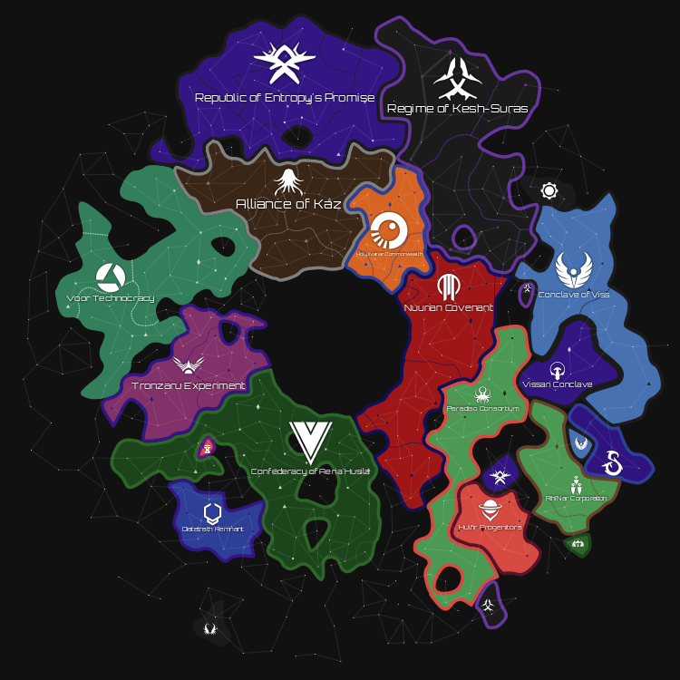

Stylized and customizable Stellaris maps

[Download the latest release here.](https://github.com/MichaelMakesGames/stellarmaps/releases)

# Features

- Country borders
- Country names and emblems
- Sector borders
- Capital / sector capital / populated system icons
- Hyperlanes and hyper relays
- Gateways and wormholes
- Unions mode
- Terra incognita
- Background galaxy graphics
- PNG and SVG export
- Modded emblem and name support
- Save and load multiple setting profiles

## Planned

- Time-lapses
- Map Modes
- Map Legend

## Known Issues

- Does not work with mod packs using Irony's "Compressed" merge
- Exported SVGs are tested with Inkscape and web browsers. Other viewers/editors may or may not work
- If viewing an SVG with Inkscape, the default Orbitron font will not work unless installed on your computer. [You can download it here.](https://fonts.google.com/specimen/Orbitron)

# Credits

The app icon is [Orbital](https://game-icons.net/1x1/lorc/orbital.html) by Lorc, licensed under [CC BY 3.0](http://creativecommons.org/licenses/by/3.0/).

Map icons are made by me. Basic shapes are released to the public domain, but others (Wormhole, Gateway, L-Gate, etc) are based on icons from the game Stellaris, and should not be used other than for tools or mods for the game.

The Discord icon is from https://discord.com/branding.

Other interface icons from [Heroicons](https://heroicons.com), licensed under the [MIT license](https://github.com/tailwindlabs/heroicons/blob/master/LICENSE).

# Local Development

[Follow the tauri prerequisites guide](https://tauri.app/v1/guides/getting-started/prerequisites). Install a recent version of Node.js. Then, in the root directory, run `npm run dev`.

## Electron

There is an Electron version available for local development. Some changes to the package.json are required. You can run `electron-on.sh` to make those changes, then run `npm run dev`. When you are finished, run `electron-off.sh` to revert the changes to package.json.

This exists mostly for debugging in Chromium. The release builds all use Tauri. Currently, the Electron version lacks the following features:

- loading data (localization, emblems, colors) from Stellaris mods
- production builds
